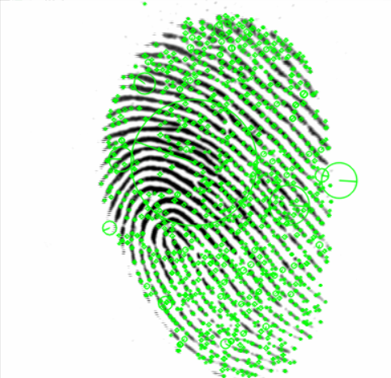
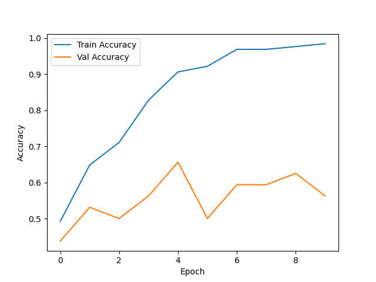

# Fingerprint_Recognition_Metrics
Status: Ongoing
Current draft: 30/05/2025

In this personal project, I compared the performance of two common image comparison tools: SIFT (Scale-invariant feature transform) and Neural networks, when applied to fingerprint recognition. 

1) SIFT:

   

  - Using gray-scale, normalized images
  SIFT found approximately 1550 keypoints from each image of one fingerprint. However, there were at most only 555 matches between two images, resulting in a similarity score of around 35.49%. 
  Since the industry-accepted similarity score is 50% to accept two fingerprints as identical, I conclude that SIFT, without further modifications, is not sufficient for fingerprint recognition. 

2) Convolutional Neural Network (CNN):
   - Using the pre-trained weights of MobileNetV2 for transfer learning
   - Using a Siamese network architecture to construct a similarity function

   Since the number of images per fingerprint per individual is very low (8), vanilla NN would not perform very well. (In some tests, I only achieved a similarity score of ~ 30%, which is subpar to the basic SIFT.
   Therefore, I used a Siamese architecture, which instead of memorizing classes, learns a distance metric based on the similarity of two images.
   The performance is much better compared to SIFT:
   - Final training accuracy: 0.9865 (There is some overfitting, to be expected given the small sample size)
   - Final validation accuracy: 0.5625
   - Recognition accuracy by nearest neighbor: 71.25%, much better than the Similarity score of SIFT (35.49%).
  
     

  
The dataset used is from the publicly available FVC2000 competition(http://bias.csr.unibo.it/fvc2000/).
The analysis is inspired by: Handbook of Fingerprint Recognition, Maltoni et al.

