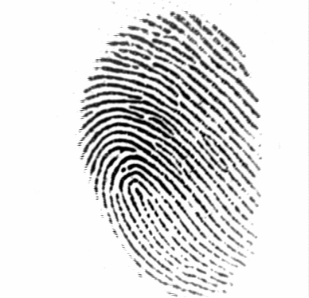

# Fingerprint_Recognition_Metrics

Fingerprints are the most widely used biometric for identification and authentication. With the emergence of deep learning, government fingerprint databases are able to store, monitor, and match fingerprints at a large scale. Furthermore, fingerprints are a popular tool for unlocking devices and accessing information in the commercial sector. 

In this exploratory analysis, I investigate the accuracy and performance of different types of fingerprint matching algorithms, starting with basic image comparison algorithms such as scale-invariant feature transform (SIFT), and advancing onto convolutional neural networks(CNN).

The dataset used is from the publicly available FVC2000 competition(http://bias.csr.unibo.it/fvc2000/). 
